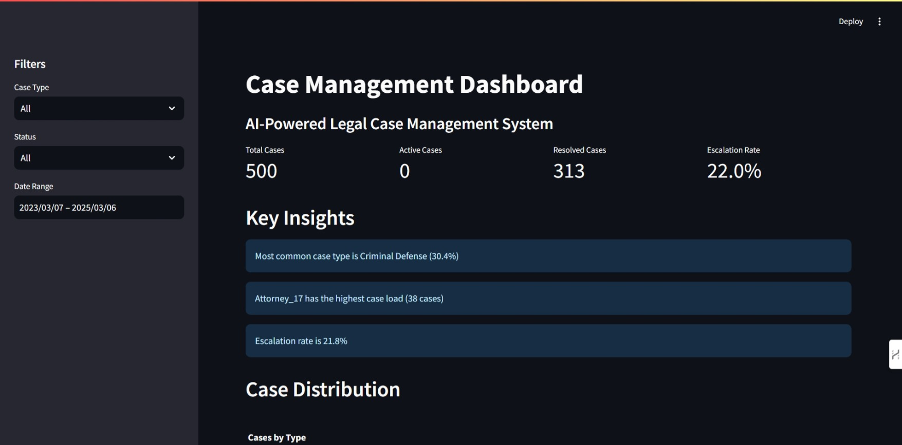

# Case Management AI System

An AI-powered legal case management system that helps law firms and legal departments manage cases more efficiently through predictive analytics and automated insights.

## Features

- 🤖 AI-powered case outcome prediction
- 📊 Interactive dashboard with real-time insights
- 📈 Case analytics and trend analysis
- 🔄 Automated case status updates
- 📋 Case priority management
- 👥 Resource allocation suggestions

## Architecture

### Backend
- FastAPI for REST API
- Random Forest model for predictions
- SQLite database for data storage
- Python-based data processing pipeline

### Frontend
- Streamlit dashboard
- Interactive data visualization
- Real-time updates
- Responsive design

## Getting Started

### Prerequisites
- Python 3.12+
- pip (Python package manager)

### Installation

1. Clone the repository:
```bash
git clone https://github.com/djpapzin/case-management-ai.git
cd case-management-ai
```

2. Install dependencies:
```bash
pip install -r requirements.txt
```

3. Generate sample data:
```bash
python app.py --generate-data
```

4. Train the model:
```bash
python app.py --train-model
```

5. Start the API server:
```bash
python app.py --run-server
```

6. Run the dashboard:
```bash
python -m streamlit run dashboard.py
```

The dashboard will be available at http://localhost:8501

## Project Structure

```
case-management-ai/
├── src/
│   ├── api/            # FastAPI endpoints
│   ├── data/           # Data processing and generation
│   ├── model/          # ML model implementation
│   └── utils/          # Helper functions
├── docs/               # Documentation
├── tests/              # Test files
├── config/             # Configuration files
├── scripts/            # Utility scripts
├── app.py             # Main application
├── dashboard.py       # Streamlit dashboard
└── requirements.txt   # Python dependencies
```

## Usage

1. Access the dashboard at http://localhost:8501
2. Use the sidebar filters to analyze specific case types
3. View real-time metrics and insights
4. Export reports as needed

### Dashboard Preview



*The dashboard provides real-time metrics, key insights, and interactive visualizations for case management.*

## Development

### Running Tests
```bash
python -m pytest tests/
```

### Code Style
We follow PEP 8 guidelines. Run the linter:
```bash
flake8 .
```

## Contributing

1. Fork the repository
2. Create a feature branch
3. Commit your changes
4. Push to the branch
5. Create a Pull Request

## License

This project is licensed under the MIT License - see the LICENSE file for details.

## Acknowledgments

- Thanks to all contributors
- Built with Python, FastAPI, and Streamlit
- Powered by scikit-learn 